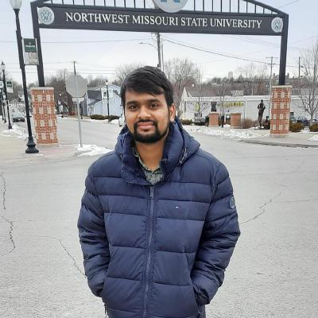

# big-data-dev
# Preferred Name: Harish

## Current
- I'm a senior graduate student at NorthWest Missouri State University and this is my final semester.  I'm working as software developer at Learning and Teaching Center at NWMSU. Also, I'm Working as Graduate Assistant for CS class.

## Background
- I'm from Hyderabad, India. I have completed my under graduation in Electronics and Communication Engineering from Osmania University, Hyderabad, India. 
- Later, I worked as software engineer for 2.5 years in Accenture Solutions Pvt ltd. 
- My Hobbies are playing Chess, Badminton, Table Tennis and Pool.

## Future Plans
- As I was experienced with web development, I'm interested to work on full stack web development.

## Here you can find me!

- LinkedIn:  https://www.linkedin.com/in/harish-thadka-059341196/
- GitHub: https://github.com/harishThadka
- Project: https://github.com/harishThadka/shell-data-processing

